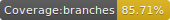

# Ngx-Bdir
A bidirectional support lib for angular

## Project policies and statuses
[](https://travis-ci.org/10bis/ngx-bdir)




 
## Getting Started

### Installation

install with npm:

```npm install ngx-bdir --save```

### Usage

1. Import the `BDirModule`:

    ```ts
    import {BrowserModule} from '@angular/platform-browser';
    import {NgModule} from '@angular/core';
    import { BDirModule } from 'ngx-bdir';
    
    @NgModule({
        imports: [
            BrowserModule,
            BDirModule
        ],
        bootstrap: [AppComponent]
    })
    export class AppModule { }
    ```

2.  Add `bdir` directive In the application wrapper:

    ```html
    <div id="app-wrapper" bdir> 
      <h1>
          Welcome to {{ title }}!
      </h1>
      <router-outlet></router-outlet>
    </div>
    ```

3.  Start using `scss mixins`:
    ```scss

    @import "~ngx-bdir/styles/bdir.mixins";
    h1 {
      color: darkslategray;
      @include padding-start(20px);
    }
    ```

    Now the `h1` element will transpile to:
    
    ```scss
    h1 {
      color: darkslategray;
    }
    *[dir=ltr] h1 {
      padding-right: 20px; }
    
    *[dir=rtl] h1 {
      padding-left: 20px; }
    ```

## API

#### BDirService
##### Methods:
*`setLang(lang: Lang)` - Setting the current language which will determine the direction value

*`setDir(dir: Direction)` - Set the current direction value.

*`getDir$(): Observable<Direction>` - Get the current direction value as observable.

*`setLang(lang: Lang)` - Get the opposite direction value as observable.

#### BDirDirective
`bdir: 'start' | 'end'` - Will set a `dir` attribute to the hosting element with `rtl | ltr` value accordingly `start`, is the default value.
```angular2html
  <element bdir="start"></element>
```

#### Tokens
`RTL_LANGUAGES` - Define which language will consider as `rtl` languages, default value: `['he', 'ar', 'hy', 'dv', 'ff', 'ku', 'fa']`.

`DEFAULT_LANG` - Define the default language, default value: `'en'`


#### Mixins
>All `mixins` were written following to the `css` syntax, simply change **left** & **right** with **start** & **end**.

>Also the `mixins` were developed in a way that the transpiled code will be as minimal as possible.

**`*$encapsulation`** property used for inner components to be affected by their host's direction by using angular's [:host-context](https://angular.io/guide/component-styles#host-context)

`padding-start($padding, $encapsulation: true)`

`padding-end($padding, $encapsulation: true)`

`margin-start($margin, $encapsulation: true)`

`margin-end($margin, $encapsulation: true)`

`float($start: true, $encapsulation: true)`

`dir($start: true, $encapsulation: true)`

`start($value, $encapsulation: true)`

`end($value, $encapsulation: true)`

`transformTranslate($x, $y: 0, $encapsulation: true)`

`transformScale($x, $y: 1, $encapsulation: true)`

`mirror($encapsulation: true)`
